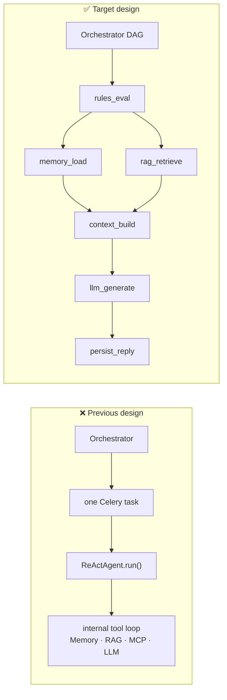
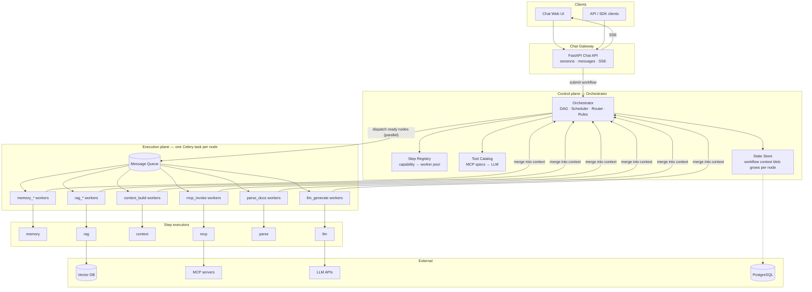
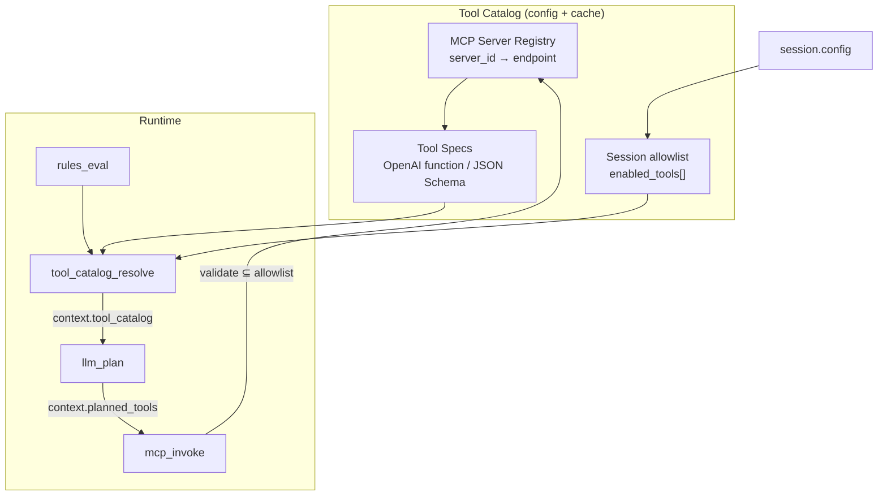
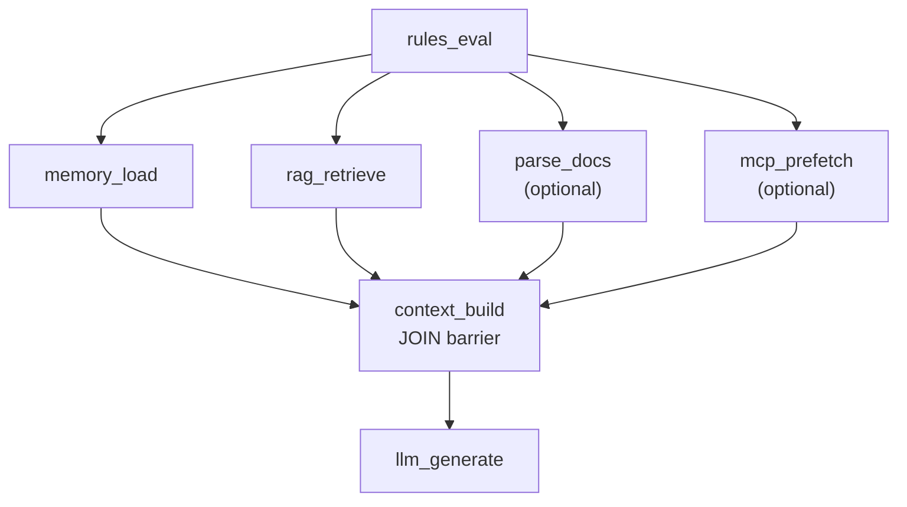
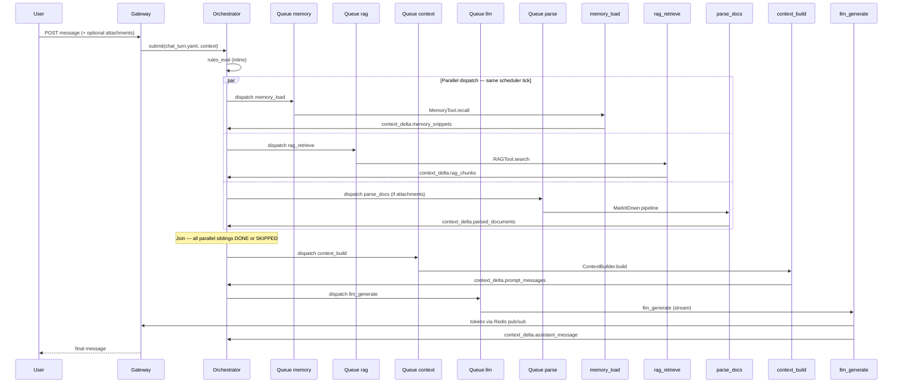
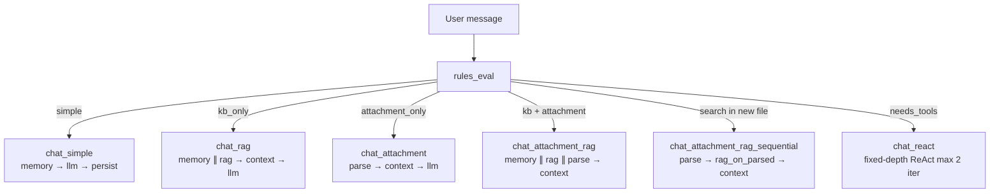

# 02 — Architecture

## Core design shift

The agent is **not** a monolithic in-process loop (`ReActAgent.run()`). Each capability is a **first-class orchestrator DAG node**, executed by its own Celery task. The **workflow YAML is the agent** — the orchestrator defines the full pipeline; the LLM node runs last on assembled context.



| Concept | Old | New |
|---------|-----|-----|
| Agent behavior | Hidden inside ReAct loop | Explicit YAML workflow |
| Tool use | Agent decides at runtime | Orchestrator schedules nodes; rules may skip/add nodes |
| Observability | Opaque tool_trace blob | Per-node status, retry, DLQ, metrics |
| Scaling | Scale one `chat` worker | Scale `rag`, `mcp`, `llm` queues independently; **parallel fan-out** for memory + rag |
| Step library | Hidden in agent class | Explicit executors per capability (memory, RAG, MCP, context, LLM) |

Agent paradigms from tutorials (`SimpleAgent`, `ReActAgent`) are expressed as **workflow templates**, not as a single Celery entrypoint.

---

## System context



---

## Layer responsibilities

### 1. Chat Gateway

Owns sessions and messages only. Does **not** assemble prompts or call step executors directly.

- `POST /sessions/{id}/messages` → pick workflow template → `orchestrator.submit(yaml, context)`
- Poll or SSE on workflow progress (node-level timeline)
- Stream tokens from `llm_generate` node via Redis pub/sub

### 2. Orchestrator (extended mini-agent-orchestrator)

The orchestrator **is** the agent runtime. Same modules as today, new chat step capabilities:

| Module | Role in decomposed model |
|--------|--------------------------|
| `dag.py` | Chat pipeline with **parallel fan-out** (memory ∥ rag ∥ mcp) → join at `context_build` |
| `orchestrator.py` | Schedule all ready nodes in one tick; merge `context_delta` per callback |
| `rules.py` | Skip/include nodes (e.g. skip `rag_retrieve` if KB off); route LLM tier |
| `router.py` | Pick worker pool per capability (`llm_generate` → senior/junior) |
| `registry.py` | Register step workers, not monolithic agents |
| **`tool_catalog.py`** | **Resolve MCP/builtin tool specs → `context.tool_catalog` for LLM** |
| `tasks.py` | One task type per capability; calls one step executor |
| Resilience | Per-node retry, DLQ, CB, idempotency, resync sweep |

### 3. Step executors

Each capability exposes a **single-responsibility executor** invoked by Celery:

| Capability | Node output (written to context) |
|------------|----------------------------------|
| `memory_load` | `context.memory_snippets` |
| `memory_store` | confirmation |
| `rag_retrieve` | `context.rag_chunks` |
| `rag_index` | `context.index_status` (async ingest) |
| `parse_docs` | `context.parsed_documents` |
| `context_build` | `context.prompt_messages` |
| `mcp_invoke` | `context.mcp_results[]` |
| `llm_generate` | `context.assistant_message` + stream |
| `persist_reply` | message row id |

No step calls another step directly — only the orchestrator passes the growing context to the next node. **Independent steps sharing the same `after[]` are dispatched in parallel** (multiple queue publishes per scheduler tick).

### 4. Tool & MCP Catalog (LLM-facing registry)

**Step Registry** (`registry.py`) answers: *which Celery worker pool runs `mcp_invoke`?*  
**Tool Catalog** answers: *which tools exist, what are their specs, and what may the LLM request in `llm_plan`?*

These are **separate registries**. The LLM never sees worker names like `mcp_amap_v1` — it sees **tool specifications** (name, description, JSON Schema parameters).



#### What gets stored

| Store | Path (planned) | Contents |
|-------|----------------|----------|
| **MCP Server Registry** | `config/mcp_servers/*.yaml` | `server_id`, launch command/sidecar URL, env ref, health endpoint |
| **Tool Spec Catalog** | `config/tools/*.yaml` + MCP `tools/list` cache | Per-tool metadata for LLM |
| **Tenant overrides** | DB / `config/tenants/{id}/tools.yaml` | Enable/disable tools per tenant |
| **Session allowlist** | `session.config.enabled_tools` | Subset user/session may use this turn |

#### Tool spec shape (LLM + validation)

Compatible with **OpenAI function calling** / standard tool schema format:

```yaml
# config/tools/amap_maps_weather.yaml
tool_id: amap.maps_weather
display_name: maps_weather
server_id: amap
kind: mcp                    # mcp | builtin (future)
description: |
  Get weather forecast for a city or district in China.
parameters:
  type: object
  required: [city]
  properties:
    city:
      type: string
      description: City name, e.g. "Beijing"
policy:
  tier: standard               # standard | premium
  timeout_sec: 10
  cost_units: 1
```

MCP tools can be **authored manually** (YAML above) or **synced from MCP** `tools/list` on server startup, then cached in Redis/Postgres with TTL.

#### Resolution flow (before `llm_plan`)

Node **`tool_catalog_resolve`** (inline in orchestrator or lightweight Celery step) runs after `rules_eval` when workflow is `chat_react`:

1. Start from tenant's enabled tools.
2. Intersect with `session.config.enabled_tools` (if set).
3. Apply rules (e.g. travel session → add amap tools; block `terminal_exec`).
4. Build `context.tool_catalog` — array of `{type: "function", function: {name, description, parameters}}`.
5. Pass to `llm_plan` via `context_build` or directly in plan worker prompt.

```json
{
  "tool_catalog": [
    {
      "type": "function",
      "function": {
        "name": "maps_weather",
        "description": "Get weather forecast for a city",
        "parameters": { "type": "object", "properties": { "city": { "type": "string" } }, "required": ["city"] }
      }
    },
    {
      "type": "function",
      "function": {
        "name": "maps_text_search",
        "description": "Search POI by keywords",
        "parameters": { "type": "object", "properties": { "keywords": { "type": "string" } }, "required": ["keywords"] }
      }
    }
  ],
  "tool_catalog_version": "2026-08-10-amap-v3"
}
```

#### How `llm_plan` uses the catalog

`llm_plan` worker prompt includes:

- System: planner instructions + **full or filtered `tool_catalog`**
- User: `user_message` + memory snippets
- Output contract (structured JSON):

```json
{
  "planned_tools": [
    {
      "tool_id": "amap.maps_weather",
      "name": "maps_weather",
      "arguments": { "city": "Da Nang" }
    }
  ],
  "needs_another_round": false,
  "reasoning": "User asked for weather; one tool sufficient"
}
```

LLM **chooses from catalog only** — cannot invent tool names. Invalid names fail validation → retry plan or skip tool.

#### How `mcp_invoke` validates

Before invoking MCP tool:

| Check | Action |
|-------|--------|
| `tool_id` in session allowlist | else reject → DLQ / observe error |
| `arguments` match JSON Schema | pydantic/jsonschema validate |
| `server_id` circuit breaker CLOSED | else fallback / skip |
| Map `tool_id` → `server_id` + MCP tool name | from Tool Catalog |

```json
{
  "context_delta": {
    "mcp_results": [
      {
        "tool_id": "amap.maps_weather",
        "tool": "maps_weather",
        "arguments": { "city": "Da Nang" },
        "output": { "temp": 31, "condition": "cloudy" },
        "latency_ms": 820
      }
    ]
  }
}
```

#### Builtin orchestrator steps vs MCP tools

| Kind | Exposed to LLM in `tool_catalog`? | Invoked via |
|------|-----------------------------------|-------------|
| MCP tools (maps, github, …) | ✅ Yes — `llm_plan` picks | `mcp_invoke` |
| `rag_retrieve`, `parse_docs` | ❌ No — workflow/rules decide | Orchestrator DAG |
| `memory_load` | ❌ No | Always first in tier |

RAG/parse are **pipeline steps**, not ad-hoc tools the planner calls. Optional future: expose `search_knowledge_base` as a **builtin** catalog entry that maps to `rag_retrieve` node.

#### Discovery & refresh

| Source | When |
|--------|------|
| Static YAML in `config/tools/` | Deploy time |
| MCP `tools/list` | Worker startup / cron every 5–15 min |
| Admin API `POST /v1/admin/tools/sync/{server_id}` | Manual refresh |

Catalog version bump invalidates planner cache keys (same pattern as rules `rule_set_version`).

See [04-integration-design.md](04-integration-design.md) § Tool Catalog contract and [05-chat-workflows.md](05-chat-workflows.md) § `tool_catalog_resolve`.

---

### 5. Parallel scheduling (default — not sequential)

Sequential prefetch chains are **avoided**: memory, RAG, document parsing, and MCP prefetch only need initial context (`user_message`, session ids, attachment refs) — not each other's outputs. **`context_build` is a join node** — it waits for parallel siblings, never runs alongside them.



| Phase | Nodes | Execution |
|-------|-------|-----------|
| 1 | `rules_eval` | Inline |
| 2 | `memory_load`, `rag_retrieve`, `parse_docs`, `mcp_prefetch` | **Parallel** — push to queues simultaneously |
| 3 | `context_build` | **Join** — when all predecessors DONE or SKIPPED |
| 4 | `llm_generate` | Single (stream) |
| 5 | `memory_store` → `persist_reply` | Sequential (need LLM output) |

**Scheduler** (same as RFQ `schema_validate` ∥ `risk_validate`):

1. Find all nodes whose `after[]` dependencies are satisfied.
2. Dispatch **every ready node in one tick** to separate capability queues.
3. On callback, merge `context_delta`; re-run scheduler for newly unblocked nodes.
4. `SKIPPED` optional nodes count as DONE for join logic (`rag_retrieve`, `parse_docs`, `mcp_prefetch` when not needed).

**Latency:** parallel phase cost = `max(T_memory, T_rag, T_parse, T_mcp)`, not their sum.

**`parse_docs` in chat turns:** when the user attaches files, gateway puts S3 keys / refs in submit context. `parse_docs` runs **in parallel with** `memory_load` and `rag_retrieve` — KB search and attachment parsing happen at the same time. Parsed text lands in `context.parsed_documents`; `context_build` merges it with RAG chunks. No need to wait for parse before searching the existing index.

> **Exception — ingest workflow only:** `rag_index` must stay `after: [parse_docs]` because indexing requires parsed text. That is offline/admin, not the hot chat path.

> **Not every turn uses full parallel prefetch.** Rules select a **workflow tier** first (`chat_simple`, `chat_rag`, `chat_attachment`, …). See [Adaptive workflow selection](#adaptive-workflow-selection) and [09-design-decisions-vi.md](09-design-decisions-vi.md).

### 6. Workflow context blob

Shared mutable context accumulates across nodes (stored in orchestrator state):

```json
{
  "session_id": "sess_123",
  "turn_id": "turn_456",
  "tenant_id": "acme",
  "user_message": "What is our refund policy?",
  "attachments": [{"s3_key": "acme/uploads/policy.pdf", "mime": "application/pdf"}],
  "memory_snippets": ["User prefers concise answers"],
  "parsed_documents": [{"source": "policy.pdf", "text": "...", "pages": 12}],
  "rag_chunks": [{"text": "...", "source": "policy.pdf", "score": 0.92}],
  "mcp_results": [{"tool": "maps_text_search", "output": "..."}],
  "prompt_messages": [
    {"role": "system", "content": "..."},
    {"role": "user", "content": "..."}
  ],
  "assistant_message": null,
  "stream_channel": "stream:sess_123:turn_456",
  "tool_catalog": [{"type": "function", "function": {"name": "maps_weather", "description": "...", "parameters": {}}}],
  "planned_tools": [{"tool_id": "amap.maps_weather", "name": "maps_weather", "arguments": {"city": "Da Nang"}}]
}
```

`context_build` reads prior fields; `llm_generate` consumes `prompt_messages` only. `llm_plan` consumes `tool_catalog` + user message.

---

## Default chat turn flow



Post-LLM steps (`memory_store`, `persist_reply`) stay sequential — they depend on the final answer.

Optional **`mcp_prefetch`** joins the same parallel fan-out (`after: [rules_eval]`) when the workflow needs external tool data before context assembly.

---

## Adaptive workflow selection

Not every message runs the full parallel DAG. **`rules_eval` sets `context.intent` and picks a workflow template** before Celery dispatch.



| Intent | When | Parallel prefetch? |
|--------|------|-------------------|
| `simple` | No KB, no attachment, no tools | No — 3 nodes sequential |
| `kb_only` | RAG enabled | memory ∥ rag |
| `attachment_only` | File only, no KB | parse only (sequential) |
| `kb_and_attachment` | Compare file + KB | memory ∥ rag ∥ parse |
| `rag_on_attachment` | Query inside uploaded file | parse → rag (sequential) |
| `needs_tools` | MCP / tools | ReAct workflow (MCP after `llm_plan`) |

---

## ReAct: fixed-depth (MVP) vs deep (Phase 3)

Monolithic `ReActAgent` uses an **unbounded** think → act → observe loop. Real Chat Agent **does not port that loop** into Celery for MVP.

| | MVP (Phase 1–2) | Phase 3+ |
|---|-----------------|----------|
| Model | `chat_react.yaml` static DAG | **Temporal** workflow |
| Depth | **`max_iterations: 2`** (config on workflow) | Configurable cap (e.g. 10) + HITL |
| LLM calls | Up to 2× (`llm_plan` / `llm_observe`) + 1× `llm_generate` | Dynamic per iteration |
| Tool placement | MCP **after `llm_plan`**, parallel with optional `rag_retrieve` | Same + signals |

**MVP limitation (explicit):** *Fixed-depth ReAct — maximum 1–2 tool rounds per turn. Deeper agent loops require Phase 3 Temporal or Research mode.*

One ReAct **iteration** in MVP:

```
llm_plan → (mcp_invoke ∥ rag_retrieve?) → context_build → llm_observe
```

If `iteration < max_iterations` and rules/context flag `needs_another_round`, orchestrator may start **iteration 2** (second workflow segment or duplicated subgraph — implementation detail Phase 2). Otherwise → final `llm_generate`.

**Phase 3:** Migrate unbounded / long-running ReAct to Temporal — durable history, replay, native loops. Do not extend Celery DAG into ad-hoc dynamic graphs.

---

**MVP ReAct** — `chat_react.yaml` with **`max_iterations: 2`**:

```yaml
# workflows/chat_react.yaml — fixed-depth ReAct (MVP)
name: chat_react
max_iterations: 2                    # ADR-08: hard cap MVP; deep ReAct → Temporal Phase 3
steps:
  - id: rules_eval
    after: []
    capability: rules

  - id: memory_load
    after: [rules_eval]
    capability: memory_load

  - id: tool_catalog_resolve
    after: [memory_load]
    capability: tool_catalog_resolve    # build context.tool_catalog from config/tools + session allowlist

  - id: llm_plan
    after: [tool_catalog_resolve]
    capability: llm_generate
    params: { mode: plan_tools, tools_from: context.tool_catalog }

  - id: mcp_invoke
    after: [llm_plan]
    capability: mcp_invoke
    params: { tools_from: context.planned_tools }

  - id: rag_retrieve
    after: [llm_plan]                # parallel with mcp_invoke
    capability: rag_retrieve
    optional: true

  - id: context_build
    after: [mcp_invoke, rag_retrieve]
    capability: context_build

  - id: llm_generate
    after: [context_build]
    capability: llm_generate
    params: { mode: final_answer }

  - id: persist_reply
    after: [llm_generate]
    capability: persist_reply
```

The orchestrator scheduler replaces the in-process ReAct loop **for up to 2 iterations only**. Unbounded loops → Temporal (Phase 3).

### Straggler & timeout at join

Parallel prefetch latency = `max(T_*)`. Mitigations (ADR-06):

- Per-node timeout (`memory` 30s, `parse` 60s, `rag` 30s)
- Optional nodes: timeout → `FAILED_SKIPPED`, join with empty delta + user warning
- Large attachments: async parse path; turn proceeds without file or uses prior parse job

### Large context: ref pattern (ADR-05)

Workflow state stores **refs** for payloads > 32KB. Workers return `parsed_documents_ref`, `rag_chunks_ref`; `context_build` fetches before assembling `prompt_messages`. See [04-integration-design.md](04-integration-design.md).

---

## Session vs workflow

**One workflow per turn** (recommended): each user message runs a full DAG instance. Session history is input via `memory_load` + gateway-provided `history` slice.

**Default parallel fan-out** (same pattern as RFQ `schema_validate` + `risk_validate`):

```yaml
  - id: memory_load
    after: [rules_eval]
    capability: memory_load

  - id: rag_retrieve
    after: [rules_eval]              # parallel — NOT after memory_load
    capability: rag_retrieve

  - id: mcp_prefetch
    after: [rules_eval]
    capability: mcp_invoke
    optional: true
    # Only when session.mcp_prefetch configured — default MCP is AFTER llm_plan in chat_react

  - id: parse_docs
    after: [rules_eval]              # parallel — parses attachments while RAG searches KB
    capability: parse_docs
    optional: true

  - id: context_build
    after: [memory_load, rag_retrieve, mcp_prefetch, parse_docs]   # JOIN
    capability: context_build
```

---

## State & storage

| Data | Location |
|------|----------|
| Workflow context blob | Orchestrator state (Redis → PostgreSQL) |
| Per-node result + timing | Node status in workflow state |
| Session messages | Gateway DB |
| Vector embeddings | Vector store via `rag_*` workers |
| Parsed doc artifacts | S3 pointer in context after `parse_docs` |

---

## Failure domains (per node)

| Node | Failure | Mitigation |
|------|---------|------------|
| `memory_load` | Redis down | Retry; proceed with empty memory if rule allows |
| `parse_docs` | Corrupt PDF, timeout | Retry; skip if optional; large files via S3 pointer |
| `rag_retrieve` | Vector DB timeout | Retry; CB on index; skip node if optional |
| `mcp_invoke` | MCP server down | CB per server; DLQ; workflow may continue without MCP data |
| `llm_generate` | 429/503 | Retry with backoff; route to fallback LLM worker |
| Any | Lost callback | Resync sweep re-drives stuck node |
| Cancel | User stop | Cascade cleanup; discard late `llm_generate` via idempotency + version |

---

## Deployment units

| Unit | Scales by |
|------|-----------|
| Chat Gateway | Request rate |
| Orchestrator | Workflow submissions |
| `celery-worker-memory` | memory queue depth |
| `celery-worker-parse` | parse queue depth (attachments) |
| `celery-worker-rag` | rag queue depth |
| `celery-worker-mcp` | mcp queue depth |
| `celery-worker-llm` | llm queue depth (often bottleneck) |

See [04-integration-design.md](04-integration-design.md) for step contracts and [05-chat-workflows.md](05-chat-workflows.md) for YAML templates.
