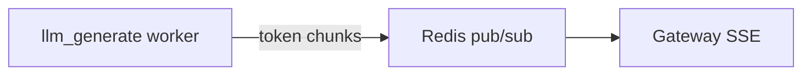

# 04 — Integration Design

Capabilities integrate **inside the orchestrator as decomposed steps** — one Celery task per node. There is no monolithic `AgentRunner` that wraps an in-process ReAct loop.

## Integration principle

```
Gateway     → WHO (session, tenant, user message)
Orchestrator → WHAT and WHEN (DAG, **parallel dispatch**, join barriers, context merge)
Celery step  → HOW for ONE step (single capability executor)
Step lib     → Implementation (memory, RAG, MCP, context, LLM client — e.g. from hello-agent)
```

Rules:

- Orchestrator never calls LLM directly — only dispatches `llm_generate` nodes.
- Celery workers never chain steps — they read context, execute one capability, return partial context delta.
- Gateway never imports step executors.
- **Parallel fan-out:** nodes sharing satisfied `after[]` are all published in one scheduler tick (see below).

---

## Parallel dispatch & join barriers

The orchestrator scheduler (from `orchestrator.py` + NetworkX DAG) treats **parallelism as default** for independent prefetch steps.

### When nodes run in parallel

Nodes are dispatched **simultaneously** when:

1. All entries in their `after[]` list are `DONE` or `SKIPPED`.
2. They are not blocked by an in-flight sibling (each node tracks its own status).

Typical chat **prefetch phase** after `rules_eval`:

| Node | Queue published | Runs while |
|------|-----------------|------------|
| `memory_load` | `queue.capability.memory` | rag, parse, mcp also running |
| `rag_retrieve` | `queue.capability.rag` | memory, parse, mcp also running |
| `parse_docs` | `queue.capability.parse` | memory, rag, mcp also running |
| `mcp_prefetch` | `queue.capability.mcp` | memory, rag, parse also running |

### Join at `context_build`

`context_build` has `after: [memory_load, rag_retrieve, parse_docs, …]`. Scheduler only dispatches it when **every** listed predecessor is terminal (`DONE` or `SKIPPED`).

Partial context is OK during parallel phase — each worker reads the submit-time context plus any deltas already merged. Workers must **not** assume sibling outputs exist; `context_build` is the first step that requires all of them.

### Context merge under parallel callbacks

Callbacks can arrive in any order. Orchestrator:

1. CAS-merge `context_delta` from the completing node.
2. Mark that node `DONE`.
3. Run scheduler — if this was the last parallel sibling, `context_build` becomes ready and is dispatched immediately.

Race-safe: two parallel callbacks use CAS on workflow `version`; loser retries merge (same as Phase 2 HA design).

---

## Large payload refs (ADR-05)

Workflow state must stay small. Step workers return **refs** for bulky output:

| Field in state | When |
|----------------|------|
| Inline in `context_delta` | ≤ 32KB total |
| `parsed_documents_ref` | Parsed PDF/text → S3 |
| `rag_chunks_ref` | Many/large chunks → side store |
| `prompt_messages_ref` | Rare; usually built inside `context_build` worker only |

Example callback:

```json
{
  "status": "success",
  "context_delta": {
    "parsed_documents_ref": "s3://bucket/tenant/turn_456/parsed.json",
    "parsed_documents_bytes": 89000
  }
}
```

`context_build` executor **fetches refs** and assembles `prompt_messages` locally — never loads full text into orchestrator Redis/Postgres row.

---

### Anti-pattern: unnecessary sequential edges

```yaml
# ❌ Slow — RAG waits for memory even though it does not use memory_snippets
- id: rag_retrieve
  after: [memory_load]

# ✅ Fast — all start after rules_eval (when intent = kb_and_attachment)
- id: rag_retrieve
  after: [rules_eval]
- id: parse_docs
  after: [rules_eval]
```

Only add a sequential edge when downstream **reads** upstream output in the same turn. **`rag_index` after `parse_docs`** is required in ingest workflows; **`parse_docs` parallel with `rag_retrieve`** is correct in chat turns (search KB while parsing new attachment).

---

## Step registry (replaces agent profiles)

Registry entries describe **worker pools**, not monolithic agents:

| Registry name | Capability | Queue |
|---------------|------------|-------|
| `memory_worker_v1` | `memory_load`, `memory_store` | `queue.capability.memory` |
| `rag_worker_v1` | `rag_retrieve`, `rag_index` | `queue.capability.rag` |
| `context_worker_v1` | `context_build` | `queue.capability.context` |
| `parse_worker_v1` | `parse_docs` | `queue.capability.parse` |
| `mcp_amap_v1` | `mcp_invoke` | `queue.capability.mcp` |
| `llm_default_v1` | `llm_generate` | `queue.capability.llm` |
| `llm_senior_v1` | `llm_generate` (premium model) | `queue.capability.llm` |
| `persist_worker_v1` | `persist_reply` | `queue.capability.persist` |

Router selects registry entry by capability + rules (e.g. `route:llm_senior_v1` for gold tenants).

---

## Tool Catalog (LLM-facing) — separate from Step Registry

| Registry | Question it answers | Consumer |
|----------|---------------------|----------|
| **Step Registry** | Which worker executes `mcp_invoke`? | Orchestrator router |
| **Tool Catalog** | What tools exist and what are their specs? | **`llm_plan` LLM** |

### Layout (planned)

```
config/
  mcp_servers/
    amap.yaml                 # server_id, command, env
  tools/
    amap_maps_weather.yaml    # tool_id, description, parameters schema
    amap_maps_text_search.yaml
  tenants/
    acme/tools.yaml           # enable/disable per tenant
```

### MCP server entry

```yaml
# config/mcp_servers/amap.yaml
server_id: amap
display_name: Amap Maps MCP
launch:
  mode: subprocess             # subprocess | sidecar | url
  command: ["uvx", "amap-mcp-server"]
  env_from: secret/amap-api-key
health:
  interval_sec: 60
circuit_breaker:
  failure_threshold: 5
  window_sec: 60
tool_discovery:
  mode: mcp_tools_list         # sync specs from MCP on startup
  cache_ttl_sec: 900
```

### `tool_catalog_resolve` contract

Runs after `rules_eval` when workflow needs planning (`chat_react`, optionally before `llm_plan`):

**Input:** `tenant_id`, `session.config.enabled_tools`, rules actions  
**Output:**

```json
{
  "context_delta": {
    "tool_catalog": [ { "type": "function", "function": { "name": "...", "description": "...", "parameters": {} } } ],
    "tool_catalog_version": "amap-v3",
    "enabled_tool_ids": ["amap.maps_weather", "amap.maps_text_search"]
  }
}
```

### `llm_plan` output contract

```json
{
  "context_delta": {
    "planned_tools": [
      {
        "tool_id": "amap.maps_weather",
        "name": "maps_weather",
        "arguments": { "city": "Hanoi" }
      }
    ],
    "needs_another_round": false,
    "react_iteration": 1
  }
}
```

Validation rules:

- Every `planned_tools[].tool_id` ∈ `enabled_tool_ids`
- `arguments` validate against catalog JSON Schema
- Max tools per plan: `max_planned_tools: 3` (configurable)

### `mcp_invoke` mapping

```yaml
# tool spec links to server
tool_id: amap.maps_weather
server_id: amap
mcp_tool_name: maps_weather    # name passed to MCPTool.run()
```

Executor resolves `tool_id` → `server_id` + `mcp_tool_name` → Step Registry worker `mcp_amap_v1`.

---

## Step configuration

Per-capability YAML (not per-agent):

```
config/step_configs/
  memory_load.yaml
  rag_retrieve.yaml
  context_build.yaml
  llm_generate.yaml
  mcp_invoke_amap.yaml
```

Example — `llm_generate.yaml`:

```yaml
capability: llm_generate
registry_name: llm_default_v1
llm:
  profile: default
  # OpenAI-compatible endpoint — direct provider OR 9Router gateway (see 07-deployment.md)
  base_url_env: OPENAI_BASE_URL          # e.g. http://localhost:20128/v1
  api_key_env: OPENAI_API_KEY
  model: gpt-4o-mini                     # 9Router maps model name → provider combo
  max_tokens: 2048
  temperature: 0.7
modes:
  plan_tools:
    system_prompt_ref: prompts/plan_tools.txt
    output_field: planned_tools
  final_answer:
    system_prompt_ref: prompts/chat_system.txt
    stream: true
    output_field: assistant_message
```

Example — `rag_retrieve.yaml`:

```yaml
capability: rag_retrieve
registry_name: rag_worker_v1
rag:
  top_k: 5
  namespace_from: context.rag_namespace
  query_from: context.user_message
  output_field: rag_chunks
```

---

## Celery task contract (all steps)

### Input (orchestrator dispatch)

```json
{
  "workflow_id": "wf_abc",
  "node_id": "rag_retrieve",
  "capability": "rag_retrieve",
  "agent_name": "rag_worker_v1",
  "dispatch_generation": 1,
  "context": {
    "session_id": "sess_123",
    "turn_id": "turn_456",
    "tenant_id": "acme",
    "user_message": "What is our refund policy?",
    "rag_namespace": "acme:kb:default",
    "memory_snippets": [],
    "stream_channel": "stream:sess_123:turn_456"
  },
  "node_params": {
    "top_k": 5,
    "optional": true
  }
}
```

### Output (callback — context delta)

Workers return **only what this node produced**; orchestrator merges into workflow context:

```json
{
  "status": "success",
  "context_delta": {
    "rag_chunks": [
      {"text": "Refunds within 30 days...", "source": "policy.pdf", "score": 0.91}
    ]
  },
  "metrics": {
    "latency_ms": 340,
    "chunks_count": 3
  }
}
```

`llm_generate` additionally streams tokens to `context.stream_channel` and sets:

```json
{
  "context_delta": {
    "assistant_message": "Our refund policy allows...",
    "token_usage": {"prompt": 2100, "completion": 180}
  }
}
```

### Error taxonomy (per step)

| Error | Step examples | Celery | Orchestrator |
|-------|---------------|--------|--------------|
| Transient | LLM 503, RAG timeout, MCP timeout | Retry ×3 | Node retries |
| Permanent | Invalid doc format in `parse_docs` | Fail fast → DLQ | Fail workflow or skip if optional |
| Optional skip | RAG miss, MCP unavailable | Return `skipped` | Continue DAG if `optional: true` |
| Cancelled | Any | Return cancelled | Cascade cleanup |

---

## Step executors (conceptual)

One executor class per capability family:

```python
# Pseudocode — documentation only

class StepExecutor(Protocol):
    capability: str
    def execute(self, context: dict, node_params: dict) -> StepResult: ...

class MemoryLoadExecutor(StepExecutor):
    capability = "memory_load"
    def execute(self, context, node_params):
        tool = MemoryTool(user_id=context["session_id"])
        snippets = tool.recall(context["user_message"])
        return StepResult(context_delta={"memory_snippets": snippets})

class RagRetrieveExecutor(StepExecutor):
    capability = "rag_retrieve"
    def execute(self, context, node_params):
        tool = RAGTool(rag_namespace=context["rag_namespace"])
        chunks = tool.search(context["user_message"], top_k=node_params.get("top_k", 5))
        return StepResult(context_delta={"rag_chunks": chunks})

class ContextBuildExecutor(StepExecutor):
    capability = "context_build"
    def execute(self, context, node_params):
        builder = ContextBuilder(...)
        messages = builder.build(
            user_message=context["user_message"],
            memory=context.get("memory_snippets", []),
            rag_chunks=context.get("rag_chunks", []),
            mcp_results=context.get("mcp_results", []),
        )
        return StepResult(context_delta={"prompt_messages": messages})

class LlmGenerateExecutor(StepExecutor):
    capability = "llm_generate"
    def execute(self, context, node_params):
        llm = HelloAgentsLLM(profile=node_params.get("llm_profile", "default"))
        messages = context["prompt_messages"]
        stream_channel = context.get("stream_channel")
        text, usage = llm.think(messages, stream=bool(stream_channel), channel=stream_channel)
        return StepResult(context_delta={
            "assistant_message": text,
            "token_usage": usage,
        })

class McpInvokeExecutor(StepExecutor):
    capability = "mcp_invoke"
    def execute(self, context, node_params):
        tool_name = node_params.get("tool") or context.get("planned_tools", [{}])[0]
        mcp = MCPTool(server_command=node_params["server_command"], ...)
        result = mcp.run(tool_name, node_params.get("args", {}))
        existing = context.get("mcp_results", [])
        return StepResult(context_delta={
            "mcp_results": existing + [{"tool": tool_name, "output": result}]
        })
```

`tasks.py` dispatches: `capability → executor class → execute()`.

---

## Context merge rules (orchestrator)

After each node callback:

1. Validate `context_delta` keys against allowed schema for that capability.
2. CAS-merge into workflow context (`version` bump).
3. Mark node DONE; unlock `after[]` dependents.
4. Emit progress event (node id, latency, status) to gateway SSE.

Large payloads (>256KB, e.g. parsed PDF text) → S3 pointer in context; downstream steps fetch by reference.

---

## Rules engine — control DAG shape

Rules run at `rules_eval` (inline, before any Celery step) and can:

| Action | Effect |
|--------|--------|
| `skip:rag_retrieve` | Mark node skipped; unblock dependents |
| `require:mcp_invoke` | Insert or un-skip MCP node |
| `route:llm_senior_v1` | Set router target for `llm_generate` |
| `workflow:chat_react_turn` | Swap workflow template |

Example:

```json
{
  "id": "skip_rag_when_disabled",
  "condition": "needs_kb == false",
  "actions": ["skip:rag_retrieve"]
}
```

This replaces hiding RAG inside ReActAgent — orchestrator visibility is explicit.

---

## MCP: one invocation per node

Unlike MCPTool inside an agent loop, each MCP call is a scheduled node:

```yaml
  - id: mcp_weather
    after: [context_build]
    capability: mcp_invoke
    params:
      server: weather
      tool: get_forecast
      args_from: context.extracted_location
```

Multiple MCP tools = multiple nodes (serial or parallel in DAG). Rules or a prior `llm_plan` node sets which tools to run.

---

## Streaming

Only **`llm_generate`** streams tokens (and optionally **`llm_plan`** for plan preview):



Earlier nodes (`rag_retrieve`, `mcp_invoke`) emit **progress events** only (e.g. "Searching knowledge base…"), not LLM tokens.

---

## Idempotency

```
key = hash(tenant_id, session_id, turn_id, node_id, dispatch_generation)
```

Critical for `llm_generate` and `memory_store` to prevent duplicate charges / duplicate memory writes on retry.

---

## Cancel flow

1. Gateway → `POST /workflows/{id}/cancel`
2. Orchestrator sets CANCELLED; revokes in-flight Celery tasks
3. Workers check cancellation before merge-sensitive steps (`llm_generate`, `memory_store`, `persist_reply`)
4. Partial `assistant_message` kept if gateway policy allows

---

## Directory layout (planned)

```
real-chat-agent/
├── gateway/
├── orchestrator/              # extended mini-agent-orchestrator
│   ├── tasks.py               # dispatches to step executors
│   └── merge.py               # context_delta CAS merge
├── steps/                     # Capability step executors (was workers/)
│   ├── memory.py
│   ├── rag.py
│   ├── context.py
│   ├── mcp.py
│   ├── parse_docs.py
│   ├── llm.py
│   └── persist.py
├── config/
│   ├── mcp_servers/         # MCP connection registry
│   ├── tools/               # Tool specs for LLM (JSON Schema)
│   └── step_configs/
├── workflows/                 # full DAG definitions
└── docs/
```

---

## What we deliberately do not do

| Pattern | Reason |
|---------|--------|
| Single `ReActAgent.run()` Celery task | Hides pipeline; poor per-step retry/metrics |
| Agent class selects tools at runtime | Orchestrator + rules own the pipeline |
| Gateway calling step executors | Breaks single control plane |

ReAct **behavior** is preserved as **`chat_react_turn.yaml`** — same logic, explicit DAG.
