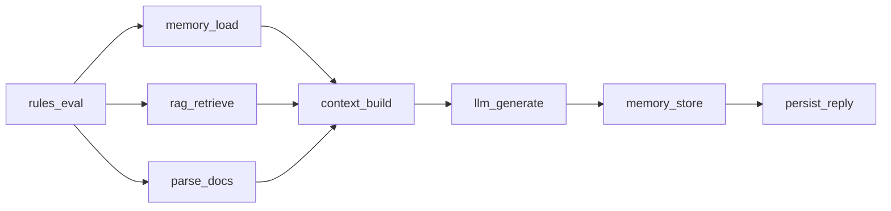
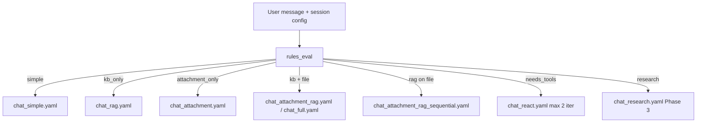

# 05 — Chat Workflows

YAML DAG templates define the **entire agent behavior**. Each step is one Celery task. The LLM always runs in explicit `llm_generate` (or `llm_plan`) nodes — never inside a black-box ReAct worker.

## Step capability reference

| Capability | Typical position |
|------------|------------------|
| `rules_eval` | First |
| `tool_catalog_resolve` | After `memory_load`, before `llm_plan` (react only) |
| `memory_load` | Early |
| `parse_docs` | **Parallel prefetch** (with memory, rag) when message has attachments |
| `rag_index` | **Ingest workflow only** — sequential after `parse_docs` |
| `rag_retrieve` | Before context_build |
| `mcp_invoke` | Before or after context_build |
| `context_build` | Before LLM |
| `llm_plan` | ReAct — reads **`tool_catalog`** |
| `llm_generate` | **Final LLM step** |
| `memory_store` | With persist |
| `persist_reply` | Last |

---

## Workflow tiers (ADR-02)

Rules pick **one template per turn** — do not force full parallel DAG on every message.

| File | Intent | Pipeline summary |
|------|--------|------------------|
| `chat_simple.yaml` | `simple` | `memory_load → llm_generate → persist_turn` |
| `chat_rag.yaml` | `kb_only` | `memory ∥ rag → context_build → llm → persist` |
| `chat_attachment.yaml` | `attachment_only` | `parse_docs → context_build → llm → persist` |
| `chat_attachment_rag.yaml` | `kb_and_attachment` | `memory ∥ rag ∥ parse → context_build → llm` |
| `chat_attachment_rag_sequential.yaml` | `rag_on_attachment` | `parse → rag_on_parsed → context_build → llm` |
| `chat_react.yaml` | `needs_tools` | Fixed-depth ReAct, `max_iterations: 2` |
| `chat_full.yaml` | complex session | Full parallel prefetch (alias of former `chat_turn`) |

### Intent routing (rules_eval actions)

```json
[
  {"id": "route_simple", "condition": "needs_kb == false and has_attachments == false and needs_tools == false", "actions": ["intent:simple", "workflow:chat_simple"]},
  {"id": "route_attachment", "condition": "has_attachments == true and needs_kb == false", "actions": ["intent:attachment_only", "workflow:chat_attachment"]},
  {"id": "route_kb", "condition": "needs_kb == true and has_attachments == false", "actions": ["intent:kb_only", "workflow:chat_rag"]},
  {"id": "route_tools", "condition": "needs_tools == true", "actions": ["intent:needs_tools", "workflow:chat_react"]}
]
```

---

## Simple chat (Phase 1 MVP)

**File:** `workflows/chat_simple.yaml`

Minimal path for ~80% traffic — **no parallel prefetch**, no `context_build` if prompt assembly is inline in `llm_generate` worker or lightweight context step optional.

```yaml
name: chat_simple
steps:
  - id: rules_eval
    after: []
    capability: rules

  - id: memory_load
    after: [rules_eval]
    capability: memory_load

  - id: llm_generate
    after: [memory_load]
    capability: llm_generate
    params:
      mode: final_answer
      include_memory_in_prompt: true
      stream: true

  - id: persist_turn
    after: [llm_generate]
    capability: persist_reply
    params:
      store_memory: true
```

---

## Default full chat (parallel prefetch)

**File:** `workflows/chat_full.yaml` (formerly `chat_turn.yaml`)

**Parallel fan-out** after rules — memory ∥ rag ∥ parse_docs, then join at `context_build`:

```yaml
name: chat_full
steps:
  - id: rules_eval
    after: []
    capability: rules

  - id: memory_load
    after: [rules_eval]
    capability: memory_load

  - id: rag_retrieve
    after: [rules_eval]              # parallel with memory_load
    capability: rag_retrieve
    optional: true                   # rules skip when needs_kb == false

  - id: parse_docs
    after: [rules_eval]              # parallel — parse attachments while RAG runs
    capability: parse_docs
    optional: true                   # rules skip when no attachments

  - id: context_build
    after: [memory_load, rag_retrieve, parse_docs]   # JOIN barrier
    capability: context_build

  - id: llm_generate
    after: [context_build]
    capability: llm_generate
    params:
      mode: final_answer
      stream: true

  - id: memory_store
    after: [llm_generate]
    capability: memory_store

  - id: persist_reply
    after: [memory_store]
    capability: persist_reply
```



> **Do not** chain `rag_retrieve.after: [memory_load]` or `parse_docs.after: [rag_retrieve]` on the chat hot path. Parse and RAG are independent until `context_build`.

### Context schema (submit payload)

```json
{
  "session_id": "sess_xxx",
  "turn_id": "turn_xxx",
  "tenant_id": "default",
  "user_message": "Summarize the attached contract",
  "attachments": [{"s3_key": "uploads/contract.pdf", "mime": "application/pdf"}],
  "rag_namespace": "default:kb",
  "needs_kb": true,
  "has_attachments": true,
  "stream_channel": "stream:sess_xxx:turn_xxx",
  "metadata": { "client": "web", "locale": "en" }
}
```

Use when intent = `kb_and_attachment` or session explicitly requests full pipeline.

---

## Attachment-only turn

**File:** `workflows/chat_attachment.yaml`

No RAG — user asks about attached file only.

```yaml
name: chat_attachment
steps:
  - id: rules_eval
    after: []
    capability: rules

  - id: parse_docs
    after: [rules_eval]
    capability: parse_docs

  - id: context_build
    after: [parse_docs]
    capability: context_build

  - id: llm_generate
    after: [context_build]
    capability: llm_generate
    params: { mode: final_answer, stream: true }

  - id: persist_turn
    after: [llm_generate]
    capability: persist_reply
```

---

## RAG on parsed attachment (sequential)

**File:** `workflows/chat_attachment_rag_sequential.yaml`

When query requires **searching inside** the newly uploaded file (not KB alone):

```yaml
name: chat_attachment_rag_sequential
steps:
  - id: rules_eval
    after: []
    capability: rules

  - id: parse_docs
    after: [rules_eval]
    capability: parse_docs

  - id: rag_on_parsed
    after: [parse_docs]
    capability: rag_retrieve
    params:
      source: parsed_documents
      query_from: context.user_message

  - id: context_build
    after: [rag_on_parsed]
    capability: context_build

  - id: llm_generate
    after: [context_build]
    capability: llm_generate

  - id: persist_turn
    after: [llm_generate]
    capability: persist_reply
```

---

## RAG-enabled turn

**File:** `workflows/chat_rag.yaml` (alias `chat_rag_turn.yaml`)

KB on, no attachment — parallel memory ∥ rag:

```yaml
name: chat_rag
steps:
  - id: rules_eval
    after: []
    capability: rules

  - id: memory_load
    after: [rules_eval]
    capability: memory_load

  - id: rag_retrieve
    after: [rules_eval]
    capability: rag_retrieve
    params: { top_k: 8 }

  - id: context_build
    after: [memory_load, rag_retrieve]
    capability: context_build

  - id: llm_generate
    after: [context_build]
    capability: llm_generate

  - id: persist_turn
    after: [llm_generate]
    capability: persist_reply
```

---

## MCP turn (maps, weather, etc.)

MCP is **one node per tool call**, not embedded in SimpleAgent:

**File:** `workflows/chat_mcp_turn.yaml`

```yaml
name: chat_mcp_turn
steps:
  - id: rules_eval
    after: []
    capability: rules

  - id: memory_load
    after: [rules_eval]
    capability: memory_load

  - id: llm_plan
    after: [memory_load]
    capability: llm_generate
    params:
      mode: plan_tools          # writes context.planned_tools[]

  - id: mcp_invoke
    after: [llm_plan]
    capability: mcp_invoke
    params:
      tools_from: context.planned_tools
      server: amap

  - id: context_build
    after: [mcp_invoke]
    capability: context_build

  - id: llm_generate
    after: [context_build]
    capability: llm_generate
    params: { mode: final_answer, stream: true }

  - id: persist_reply
    after: [llm_generate]
    capability: persist_reply
```

Parallel MCP (multiple tools at once):

```yaml
  - id: mcp_maps
    after: [llm_plan]
    capability: mcp_invoke
    params: { tool: maps_text_search, server: amap }

  - id: mcp_weather
    after: [llm_plan]
    capability: mcp_invoke
    params: { tool: maps_weather, server: amap }

  - id: context_build
    after: [mcp_maps, mcp_weather]
    capability: context_build
```

---

## Document ingest workflow (offline / admin)

**File:** `workflows/ingest_document.yaml`

Indexing new files into the vector store — **`rag_index` must follow `parse_docs`** (indexing needs parsed text). This workflow is **not** parallel; it is async/admin, off the chat hot path.

```yaml
name: ingest_document
steps:
  - id: parse_docs
    after: []
    capability: parse_docs
    params: { source_from: context.attachment_s3_key }

  - id: rag_index
    after: [parse_docs]              # sequential — depends on parsed text
    capability: rag_index
    params: { namespace_from: context.rag_namespace }
```

Chat turns use **`parse_docs` in parallel prefetch** (text for this message) while **`rag_index`** runs here or as a background job after ingest — not blocking the user's reply.

---

## ReAct — fixed-depth (MVP, ADR-08)

Replaces in-process `ReActAgent` **for up to 2 iterations only**. Deep/unbounded ReAct → **Phase 3 Temporal**.

**File:** `workflows/chat_react.yaml`

```yaml
name: chat_react
max_iterations: 2                      # MVP cap — NOT unbounded ReActAgent.run()
steps:
  - id: rules_eval
    after: []
    capability: rules

  - id: memory_load
    after: [rules_eval]
    capability: memory_load

  - id: tool_catalog_resolve
    after: [memory_load]
    capability: tool_catalog_resolve
    params:
      sources: [config/tools, mcp_discovery]
      filter: session.config.enabled_tools

  # --- Iteration 1 (and optional iteration 2 via orchestrator subgraph) ---
  - id: llm_plan
    after: [tool_catalog_resolve]
    capability: llm_generate
    params:
      mode: plan_tools
      iteration_from: context.react_iteration
      tools_from: context.tool_catalog

  - id: rag_retrieve
    after: [llm_plan]
    capability: rag_retrieve
    optional: true

  - id: mcp_invoke
    after: [llm_plan]                   # MCP after plan — NOT parallel rules_eval
    capability: mcp_invoke
    optional: true
    params: { tools_from: context.planned_tools }

  - id: context_build
    after: [rag_retrieve, mcp_invoke]
    capability: context_build

  - id: llm_observe
    after: [context_build]
    capability: llm_generate
    params:
      mode: observe
      increment_iteration: true        # if iteration < max_iterations & needs_another_round

  - id: llm_generate
    after: [llm_observe]
    capability: llm_generate
    params: { mode: final_answer, stream: true }

  - id: persist_turn
    after: [llm_generate]
    capability: persist_reply
```

### MVP vs Phase 3

| | MVP `chat_react.yaml` | Phase 3 Temporal |
|---|----------------------|------------------|
| Loop depth | **Max 2 iterations** | Configurable (e.g. 10) + safety |
| Dynamic tool choice | `llm_plan` once per iteration | Native loop / signals |
| HITL | Not supported | Native signals/queries |
| Implementation | Celery + static DAG (+ optional 2nd segment) | Temporal workflow |

**User-facing copy:** *"ReAct mode: up to 2 tool rounds (MVP). For deeper reasoning, use Research (Phase 3) or Temporal-backed agents."*

Legacy filename `chat_react_turn.yaml` → alias of `chat_react.yaml`.

---

## Tool Catalog configuration

Specs live in **`config/tools/`** + MCP discovery cache. Session picks subset via `enabled_tools`.

**Session create:**

```json
{
  "title": "Travel assistant",
  "config": {
    "enabled_tools": ["amap.maps_weather", "amap.maps_text_search", "amap.maps_direction_driving"],
    "mcp_servers": ["amap"]
  }
}
```

**Tenant default** (`config/tenants/acme/tools.yaml`):

```yaml
tenant_id: acme
allowed_tool_ids:
  - amap.maps_weather
  - amap.maps_text_search
  - internal.search_kb
blocked_tool_ids:
  - terminal.exec
```

**Flow in `chat_react`:**

```
memory_load → tool_catalog_resolve → llm_plan (sees specs) → mcp_invoke (validates planned_tools)
```

See [02-architecture.md](02-architecture.md) § Tool & MCP Catalog and [04-integration-design.md](04-integration-design.md).

---

## Deep research (Phase 3)

Multi-LLM pipeline — each phase is `llm_generate` with different prompts, not separate agent classes:

**File:** `workflows/chat_research.yaml`

```yaml
name: chat_research
steps:
  - id: memory_load
    after: []
    capability: memory_load

  - id: llm_outline
    after: [memory_load]
    capability: llm_generate
    params: { mode: research_outline }

  - id: rag_retrieve
    after: [llm_outline]
    capability: rag_retrieve

  - id: mcp_invoke
    after: [llm_outline]
    capability: mcp_invoke
    optional: true

  - id: llm_research
    after: [rag_retrieve, mcp_invoke]
    capability: llm_generate
    params: { mode: research_draft }

  - id: llm_synthesize
    after: [llm_research]
    capability: llm_generate
    params: { mode: final_answer, stream: true }

  - id: persist_reply
    after: [llm_synthesize]
    capability: persist_reply
```

---

## Workflow selection (intent-based)

See [09-design-decisions-vi.md](09-design-decisions-vi.md) ADR-03.



| Intent / condition | Template |
|--------------------|----------|
| No KB, no attachment, no tools | `chat_simple` |
| KB only | `chat_rag` |
| Attachment only | `chat_attachment` |
| KB + attachment (parallel) | `chat_attachment_rag` or `chat_full` |
| Search inside new file | `chat_attachment_rag_sequential` |
| MCP / tools | `chat_react` (**max 2 iterations** MVP) |
| Research mode | `chat_research` (Phase 3) |

---

## Rules examples

**Skip RAG when not needed**

```json
{
  "id": "skip_rag",
  "condition": "needs_kb == false",
  "actions": ["skip:rag_retrieve"]
}
```

**Skip parse when no attachments**

```json
{
  "id": "skip_parse",
  "condition": "has_attachments == false",
  "actions": ["skip:parse_docs"]
}
```

**Premium LLM for final step only**

```json
{
  "id": "gold_llm",
  "condition": "tenant_tier == 'gold'",
  "actions": ["route:llm_senior_v1"]
}
```

**Require MCP for travel session**

```json
{
  "id": "travel_mcp",
  "condition": "session_type == 'travel'",
  "actions": ["intent:needs_tools", "workflow:chat_react"]
}
```

**Route sequential RAG-on-attachment**

```json
{
  "id": "route_rag_on_attachment",
  "condition": "has_attachments == true and query_scope == 'attachment'",
  "actions": ["intent:rag_on_attachment", "workflow:chat_attachment_rag_sequential"]
}
```

---

## Comparison with RFQ demo

| Aspect | RFQ (`estimate_rfq`) | Chat (tier-dependent) |
|--------|----------------------|------------------------|
| Node meaning | ocr, extract, validate, estimate | memory, rag, parse, context, **llm**, persist |
| Simple path | N/A | `chat_simple` — 3 steps, no parallel |
| Full path | parallel validate | `chat_full` — memory ∥ rag ∥ parse → join |

The RFQ demo is the **same architectural pattern** Real Chat Agent uses — chat steps replace RFQ's simulated OCR/extract/validate nodes.

---

## SLA per node

| Node / phase | Target P95 | Notes |
|--------------|------------|-------|
| `rules_eval` | <100ms | Inline |
| **Parallel prefetch** | `max(memory, rag, parse, mcp)` | **Not sum** |
| `memory_load` | <200ms | Parallel with rag + parse |
| `rag_retrieve` | <2s | Often dominates prefetch |
| `parse_docs` | <3s | PDF/DOCX via MarkItDown; parallel with rag |
| `mcp_prefetch` | <5s | Parallel with memory/rag/parse |
| `context_build` | <500ms | After join; CPU only |
| `llm_generate` | <30s total; first token <5s | Stream to client |
| Full turn | <120s | Hard timeout + cancel |

**Prefetch phase latency** = `max(T_memory, T_rag, T_parse, T_mcp)`. Example: memory 80ms + RAG 1.5s + parse 2s → **2s** to join, not 3.58s sequential.

Priority queues bump `llm_generate` and `rag_retrieve` for premium tenants (Part A design).
