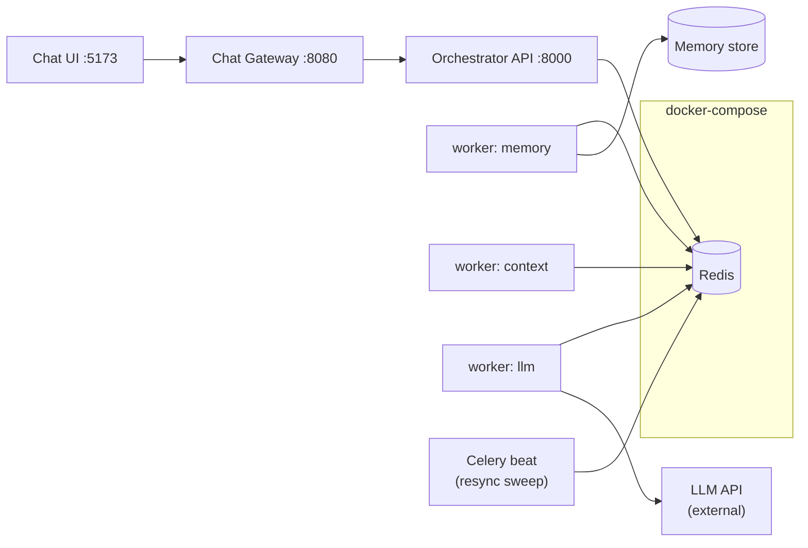
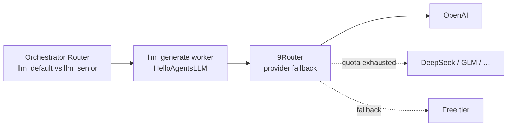
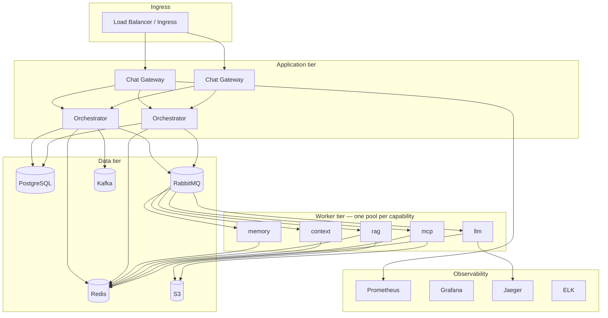

# 07 — Deployment

Production deployment plan for Real Chat Agent, progressive from local dev to full Part A topology.

## Environment tiers

| Tier | Purpose | Stack |
|------|---------|-------|
| **dev** | Local development | Docker Compose: Redis, gateway, orchestrator API, 1 Celery worker, Vite UI |
| **staging** | Integration & load test | + PostgreSQL, multiple workers, mock LLM |
| **production** | Live traffic | Part A target: Postgres, RabbitMQ, Redis, S3, Kafka, observability |

## Local development (Phase 1 target)



### Services to run

| Process | Command (conceptual) |
|---------|----------------------|
| Redis | `docker compose up redis` |
| Orchestrator API | `uvicorn orchestrator.api.main:app --port 8000` |
| Celery worker (memory) | `celery -A ... worker -Q queue.capability.memory` |
| Celery worker (context) | `celery -A ... worker -Q queue.capability.context` |
| Celery worker (llm) | `celery -A ... worker -Q queue.capability.llm` |
| Celery beat | `celery -A ... beat` |
| Chat Gateway | `uvicorn gateway.api.main:app --port 8080` |
| UI | `npm run dev` |

### Environment variables

| Variable | Component | Example |
|----------|-----------|---------|
| `REDIS_URL` | All | `redis://localhost:6379/0` |
| `ORCHESTRATOR_URL` | Gateway | `http://localhost:8000` |
| `OPENAI_API_KEY` | Workers | secret |
| `OPENAI_BASE_URL` | Workers | optional proxy |
| `HELLOAGENTS_DEFAULT_MODEL` | Workers | `gpt-4o-mini` |
| `SESSION_STORE_URL` | Gateway | `redis://localhost:6379/1` |
| `SWEEP_INTERVAL_SEC` | Beat | `20` |
| `LOG_LEVEL` | All | `INFO` |

See hello-agent `.env.example` patterns for multi-provider LLM config.

---

## LLM gateway: [9Router](https://9router.com/) (optional)

**`llm_generate` / `llm_plan` workers** call LLM via `HelloAgentsLLM`, which uses the **OpenAI-compatible API**. [9Router](https://9router.com/) is an optional **local/smart gateway** that exposes one endpoint (`http://localhost:20128/v1`) and handles **provider rotation + 3-tier fallback** (subscription → cheap → free) across 60+ providers.

### Two routing layers (do not confuse)



| Layer | Who | Decides |
|-------|-----|---------|
| **Orchestrator** | `router.py` + rules | Which **worker profile** / prompt tier (`llm_default_v1`, `llm_senior_v1`) |
| **9Router** | Sidecar / local gateway | Which **provider + model** for this HTTP request; auto fallback on 429/quota |
| **Orchestrator CB + retry** | `llm_generate` Celery task | Retry transient errors; DLQ after 3× — still applies |

9Router **replaces** juggling multiple `OPENAI_BASE_URL` keys in dev; it **complements** (does not replace) orchestrator resilience for production SaaS.

### Dev / local setup

```bash
npm install -g 9router
9router
# Dashboard: http://localhost:20128/dashboard
```

**Worker env** (`steps/llm.py` → `HelloAgentsLLM`):

```bash
OPENAI_API_KEY=9router                    # or key configured in 9Router dashboard
OPENAI_BASE_URL=http://localhost:20128/v1
HELLOAGENTS_DEFAULT_MODEL=gpt-4o-mini     # or combo name configured in 9Router
```

**Step config** (`config/step_configs/llm_generate.yaml`):

```yaml
capability: llm_generate
llm:
  profile: default
  base_url_from_env: OPENAI_BASE_URL       # points to 9Router in dev
  api_key_from_env: OPENAI_API_KEY
  model: gpt-4o-mini                         # 9Router maps model → provider chain
```

All nodes that call LLM share the same base URL:

| Node | Uses 9Router? |
|------|----------------|
| `llm_generate` | ✅ |
| `llm_plan` | ✅ |
| `llm_observe` | ✅ |

### 9Router features useful for Real Chat Agent

| 9Router feature | Chat agent benefit |
|-----------------|-------------------|
| 3-tier fallback | `llm_generate` keeps streaming when primary quota hits |
| Multi-account / combos | Tenant-like routing via different model aliases |
| Quota dashboard | Ops visibility (dev/staging) |
| Format translator | OpenAI format — matches HelloAgentsLLM |
| RTK / Caveman | Lower token cost on long `context_build` prompts |

### Production considerations

| Environment | Recommendation |
|-------------|----------------|
| **Local / solo dev** | ✅ 9Router on `localhost:20128` — simplest multi-provider setup |
| **Staging** | 9Router in Docker sidecar next to `celery-worker-llm` pod |
| **Production SaaS** | Either: (a) self-hosted 9Router as internal LLM gateway service, **or** (b) orchestrator-native multi-provider profiles + Part A CB (no 9Router dependency) |

For multi-tenant production, **do not** expose 9Router dashboard publicly. Run it as an **internal cluster service**; workers use `OPENAI_BASE_URL=http://9router.llm.svc:20128/v1`.

**Observability:** Log `model`, provider (if 9Router returns header), `token_usage` per turn in `context_delta` — correlate with 9Router dashboard quota.

See [09-design-decisions-vi.md](09-design-decisions-vi.md) ADR-11.

---



### Kubernetes sketch (Phase 3)

| Deployment | Replicas | Notes |
|------------|----------|-------|
| `chat-gateway` | 2+ | HPA on CPU / request rate |
| `orchestrator-api` | 2+ | CAS-safe (Phase 2) |
| `celery-worker-memory` | 2+ | Light CPU |
| `celery-worker-context` | 2+ | CPU for ContextBuilder |
| `celery-worker-rag` | 2+ | Embedding API calls |
| `celery-worker-mcp` | 2+ | External I/O bound |
| `celery-worker-llm` | 3+ | **Primary bottleneck**; scale on queue depth |
| `celery-beat` | 1 | Single leader |
| `chat-ui` | CDN or static | Nginx / S3 + CloudFront |

Secrets via Kubernetes Secrets or Vault: LLM keys, MCP keys, DB URLs.

---

## Queue topology

Extend orchestrator queue naming for chat:

| Queue | Consumers | Capabilities |
|-------|-----------|--------------|
| `queue.capability.memory` | memory workers | `memory_load`, `memory_store` |
| `queue.capability.rag` | rag workers | `rag_retrieve`, `rag_index` |
| `queue.capability.context` | context workers | `context_build` |
| `queue.capability.parse` | parse workers | `parse_docs` |
| `queue.capability.mcp` | mcp workers | `mcp_invoke` |
| `queue.capability.llm` | llm workers | `llm_generate`, `llm_plan` |
| `queue.capability.persist` | persist workers | `persist_reply` |
| `queue.priority.critical` | premium | Part A SLA — bump `llm` + `rag` |

---

## MCP server deployment

| Mode | When | How |
|------|------|-----|
| **Subprocess** | Dev, low traffic | Worker spawns `uvx amap-mcp-server` per MCPTool |
| **Sidecar** | K8s production | MCP container alongside worker pod |
| **Shared pool** | High traffic | Dedicated MCP gateway service |

Circuit breaker on MCP profile prevents cascade when a server is unhealthy.

---

## Database schema (draft)

### `sessions`

| Column | Type |
|--------|------|
| id | UUID PK |
| tenant_id | TEXT |
| user_id | TEXT |
| title | TEXT |
| config | JSONB |
| created_at | TIMESTAMPTZ |

### `messages`

| Column | Type |
|--------|------|
| id | UUID PK |
| session_id | UUID FK |
| turn_id | UUID |
| role | TEXT |
| content | TEXT |
| status | TEXT |
| tool_trace | JSONB |
| workflow_id | TEXT |
| created_at | TIMESTAMPTZ |

RLS: `tenant_id = current_setting('app.tenant_id')`.

Workflow authoritative state remains in orchestrator store (Postgres migration per Part A).

---

## Observability

| Signal | Source | Alert |
|--------|--------|-------|
| `chat_turn_latency_seconds` | Gateway | P95 > 30s |
| `chat_first_token_seconds` | Worker | P95 > 5s |
| `orchestrator_routing_latency_seconds` | Orchestrator | P99 > 1s |
| `workflow_completion_rate` | Orchestrator | < 99.9% / 30d |
| `step_duration_seconds{capability}` | Step workers | P95 breach per capability |
| `task_dlq_total{capability="llm_generate"}` | LLM workers | > 0 sustained |
| `circuit_breaker_state{capability="mcp_invoke"}` | MCP router | OPEN on MCP pool |

Structured logs: `trace_id`, `session_id`, `turn_id`, `workflow_id`, `tenant_id`.

---

## Security checklist

- [ ] OIDC at gateway; no anonymous production access
- [ ] Orchestrator not exposed publicly
- [ ] RLS on sessions/messages
- [ ] LLM & MCP secrets in Vault
- [ ] PII masking in logs
- [ ] Rate limits per tenant
- [ ] Content policy rules at `rules_eval` (before any step)
- [ ] `parse_docs` sandbox; TerminalTool not registered as step
- [ ] `llm_generate` only after `context_build` in all workflow templates
- [ ] CORS restricted to known UI origins

---

## CI/CD pipeline (planned)

1. **Lint & test** — `pytest` (orchestrator + gateway + worker unit tests)
2. **Integration** — Celery eager + Redis test DB (pattern from orchestrator tests)
3. **Build images** — `chat-gateway`, `step-worker-{memory,rag,context,mcp,llm}`, `orchestrator-api`
4. **Deploy staging** — smoke: create session → send message → assert reply
5. **Promote production** — blue/green or rolling

---

## Disaster recovery

| Scenario | RPO | RTO | Action |
|----------|-----|-----|--------|
| Redis loss | 0 for Postgres-backed | minutes | Restore Redis; resync sweep rebuilds cache |
| Postgres loss | backup interval | hours | Restore snapshot; workflows resume from authoritative rows |
| LLM provider outage | — | — | 9Router fallback (dev) or orchestrator CB + alternate profile (prod) |
| Region failure | 0 multi-region | hours | Failover DNS; read replica promotion |

---

## Cost drivers

- LLM token usage (dominant)
- Embedding API for RAG
- Celery worker CPU/memory (scales with concurrency)
- Vector DB storage
- Egress to MCP external APIs

Monitor `token_usage` per tenant for chargeback.
