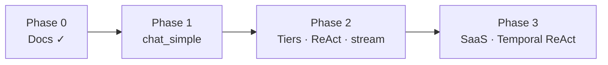

# 08 — Implementation Roadmap

Phased plan: **decomposed capability steps**, **workflow tiers**, **fixed-depth ReAct MVP**, Temporal for deep ReAct Phase 3.

---

## Phase 0 — Documentation

**Status:** Complete

**Deliverables**

- [x] Workflow-as-agent, parallel prefetch, join barriers
- [x] Workflow tiers + intent routing (ADR-02, ADR-03)
- [x] Fixed-depth ReAct max 2 iter (ADR-08)
- [x] Context ref pattern, straggler policy (ADR-05, ADR-06)
- [x] [09-design-decisions-vi.md](09-design-decisions-vi.md)

---

## Phase 1 — `chat_simple` (MVP)

**Goal:** End-to-end chat with minimal nodes — **not** full parallel DAG.

**Duration estimate:** 2–3 weeks

### Deliverables

| # | Item | Notes |
|---|------|-------|
| 1 | Repo scaffold | `gateway/`, `orchestrator/`, `steps/` |
| 2 | Step executors | `memory.py`, `llm.py`, `persist.py` |
| 3 | Context merge + refs stub | CAS merge; S3 ref for large payloads |
| 4 | `workflows/chat_simple.yaml` | `memory → llm → persist_turn` |
| 5 | Intent routing stub | Default `simple`; rules framework |
| 6 | Chat Gateway | Sessions, submit, status poll |
| 7 | Chat UI | Basic timeline |
| 8 | E2E test | One message → reply via 3 nodes |

### Out of scope Phase 1

- Parallel prefetch, RAG, parse, MCP
- `chat_react`, SSE streaming
- Temporal

### Exit criteria

- 80% test traffic path: `chat_simple` only
- Retry on `llm_generate` failure
- Cancel mid-generation

---

## Phase 2 — Workflow tiers + fixed-depth ReAct

**Goal:** Full tier set; ReAct **max 2 iterations**; parallel where intent allows.

**Duration estimate:** 3–4 weeks

### Deliverables

| # | Item |
|---|------|
| 1 | `chat_rag`, `chat_attachment`, `chat_attachment_rag`, `chat_full` |
| 2 | `chat_attachment_rag_sequential` + `rag_on_parsed` capability |
| 3 | `tool_catalog_resolve` + `config/tools/` | Specs for LLM planner |
| 4 | `chat_react.yaml` with `max_iterations: 2`, MCP after `llm_plan` |
| 4 | Intent rules (full ADR-03 table) |
| 5 | `parse_docs`, `rag_retrieve`, `context_build` executors |
| 6 | Straggler timeouts + partial join (ADR-06) |
| 7 | Context ref to S3 (ADR-05) |
| 8 | SSE from `llm_generate` |
| 9 | E2E: parallel dispatch when `chat_full` intent |

### Exit criteria

- Intent correctly picks tier (simple vs full vs attachment)
- ReAct turn completes with ≤ 2 tool rounds; UI shows iteration count
- Document in UI: *"ReAct: max 2 tool rounds (MVP)"*

---

## Phase 3 — Production SaaS + deep ReAct (Temporal)

**Goal:** Part A infra; **unbounded / deep ReAct** via Temporal, not Celery DAG hacks.

**Status:** Complete (MVP)

**Duration estimate:** 4–6 weeks

### Deliverables

| # | Item |
|---|------|
| 1 | PostgreSQL, RabbitMQ, OIDC, RLS, Kafka |
| 2 | **Temporal** workflows for `chat_react_deep`, HITL, research |
| 3 | Migration guide: MVP `chat_react` (2 iter) → Temporal (N iter) |
| 4 | `chat_research.yaml` on Temporal or extended static DAG |
| 5 | K8s / Helm, on-call runbooks |

### Exit criteria

- 99.9% turn completion
- Temporal ReAct demo: > 2 iterations with durable replay
- Celery tiers unchanged for simple/rag/attachment paths

---

## Phase 4 — Optional

| Item | Notes |
|------|-------|
| `chat_reflect.yaml` | Critique pass |
| Dynamic DAG insertion | Advanced rules |
| Cost dashboard | LLM calls × tier |

---

## Decision log

| ID | Decision | Status |
|----|----------|--------|
| D1 | Decomposed steps | ✅ |
| D2 | Workflow tiers + intent | ✅ |
| D3 | ReAct MVP max 2 iter; Temporal Phase 3 | ✅ |
| D4 | Phase 1 = `chat_simple` first | ✅ |
| D5 | Context refs > 32KB | ✅ |
| D6 | Orchestrator layout | TBD |
| D7 | Vector store | TBD |

---

## First spike (Week 1)

1. Extend `tasks.py` by `capability`.
2. Executors: `memory_load`, `llm_generate`, `persist_turn`.
3. `chat_simple.yaml` only.
4. Curl E2E — **no parallel** until Phase 2.

---

## Risk register

| Risk | Mitigation |
|------|------------|
| Over-engineering every message | **Workflow tiers** — default `chat_simple` |
| Users expect unbounded ReAct | **ADR-08** + UI copy; Temporal Phase 3 |
| parse ∥ rag wrong intent | **Intent routing** + sequential template |
| Straggler parse | Timeout + async parse (ADR-06) |
| Large context | S3 refs (ADR-05) |
