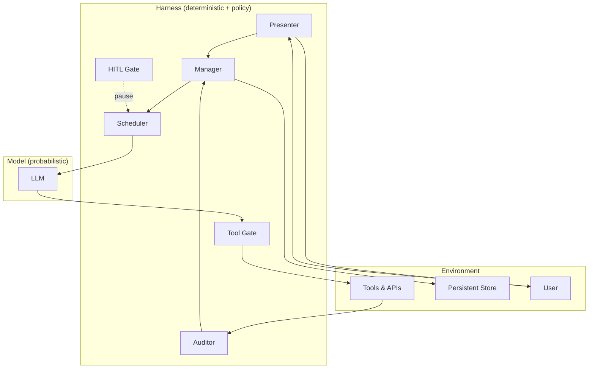
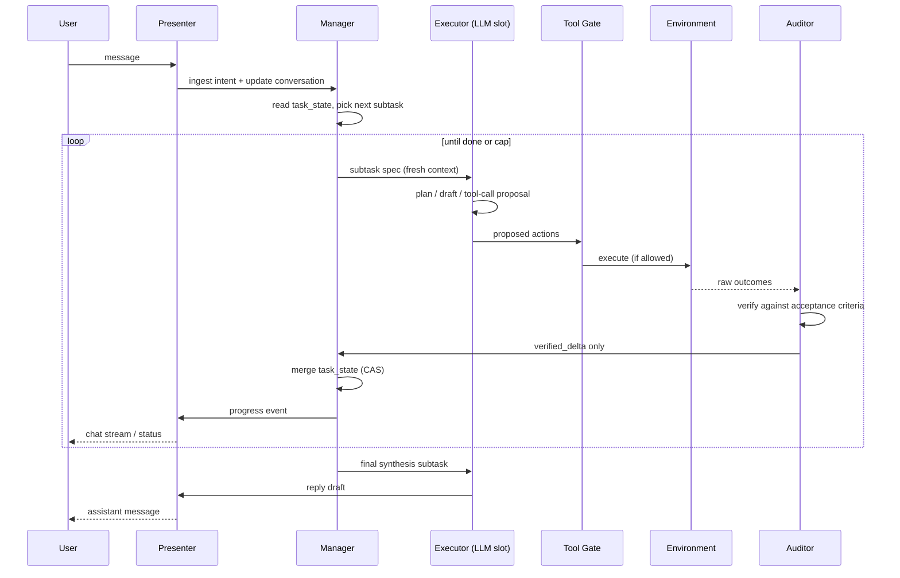
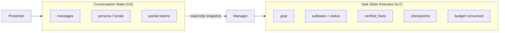
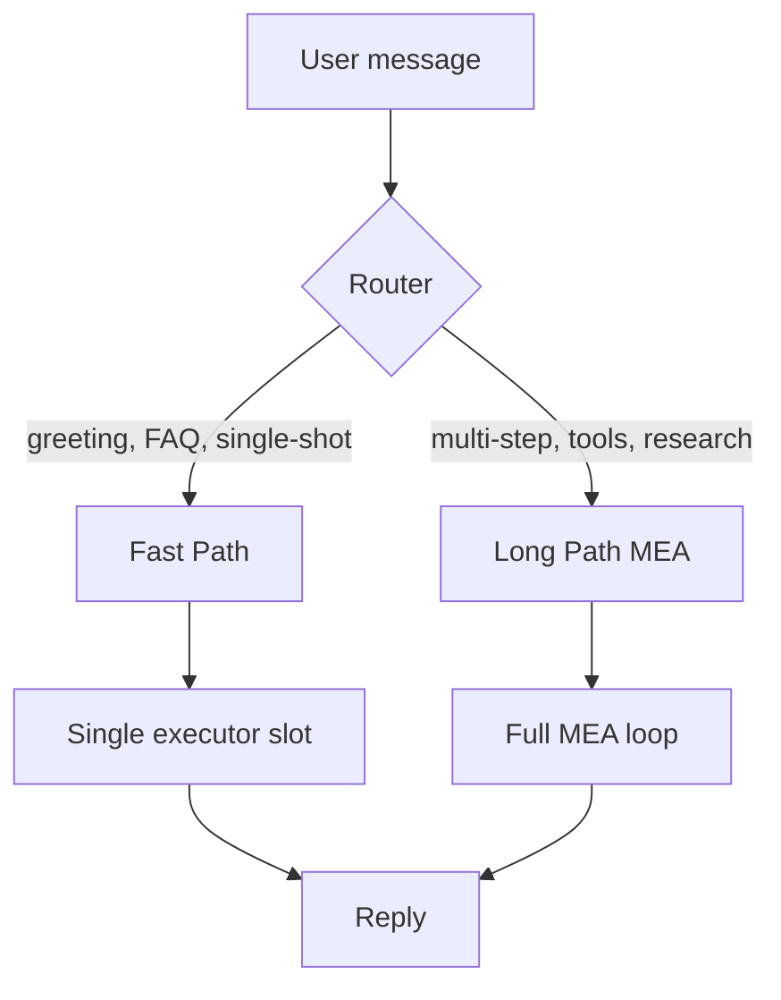
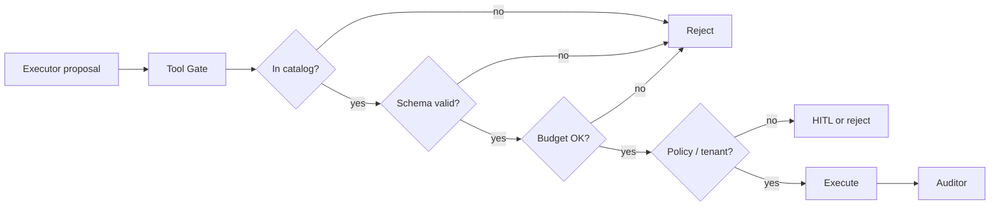
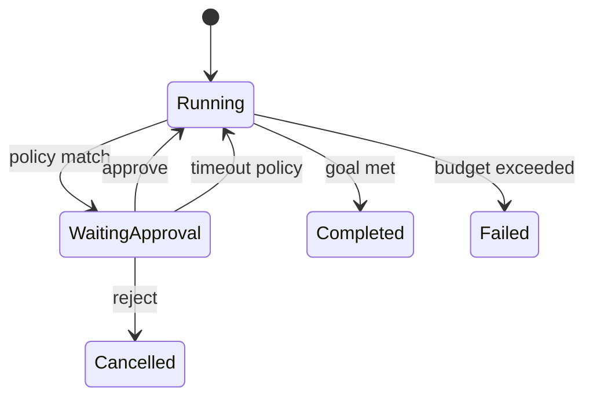
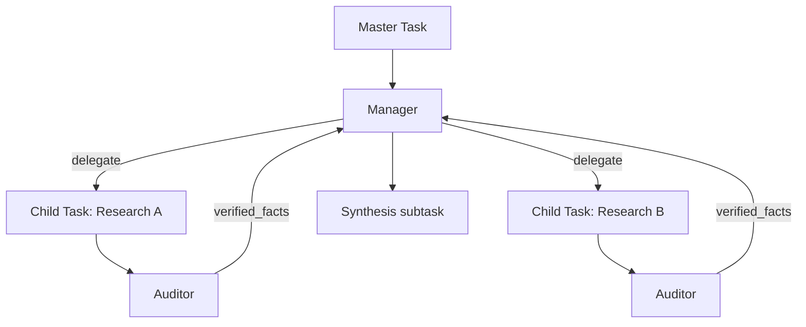
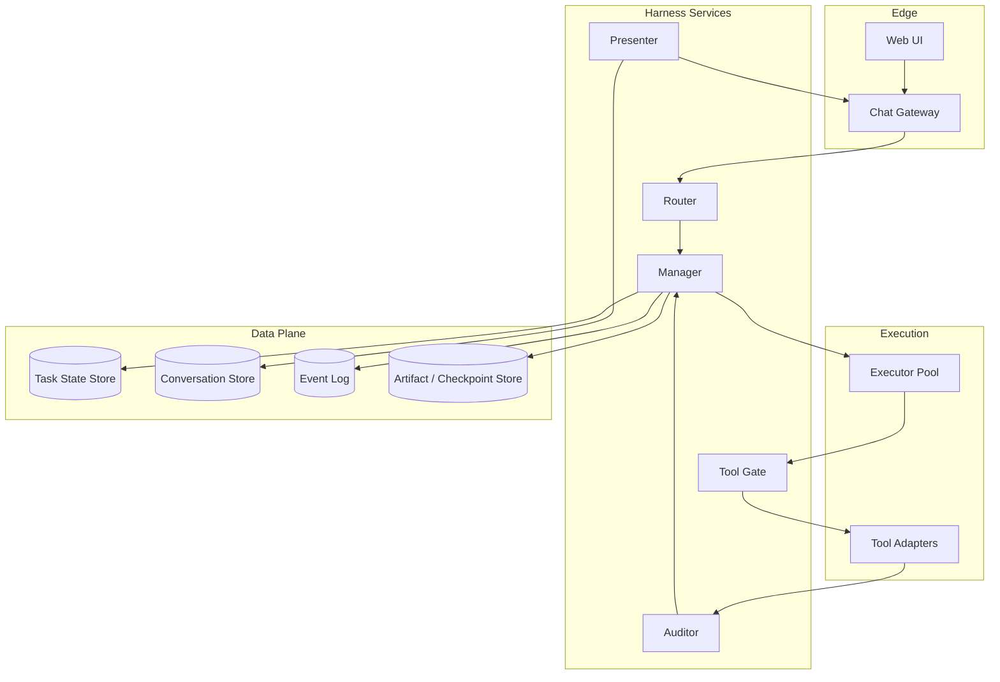

# 11 — Harness Chat Agent

*Tài liệu thiết kế greenfield: kiến trúc Harness cho Chat Agent chạy lâu dài, độc lập với stack triển khai và business logic hiện tại.*

---

## 1. Tuyên bố vấn đề

Chat agent truyền thống gắn **toàn bộ hành vi** vào một vòng lặp LLM:

```
User message → LLM → tool → LLM → tool → … → reply
```

Mô hình này thất bại khi:

| Vấn đề | Hệ quả |
|--------|--------|
| Context window phình theo thời gian | Drift, quên mục tiêu, chi phí token tăng |
| Model tự đánh giá tiến độ | Hallucinate “đã xong”, bỏ qua lỗi tool |
| Không có state ngoài prompt | Không resume sau crash; không audit được |
| Tool loop không giới hạn | Infinite loop, cascading failure |
| Chat history = task state | Mục tiêu dài hạn bị chôn trong hội thoại |

**Harness Chat Agent** tách **trí tuệ sinh text** (model) khỏi **hạ tầng điều phối** (harness). Model là một thành phần thay thế được; harness là nơi quyết định agent **có hoàn thành task hay không**.

> Vision: Một nền tảng chat nơi mỗi phiên là chuỗi subtask có kiểm chứng, user thấy hội thoại tự nhiên, hệ thống giữ task state bền vững bên ngoài context LLM.

---

## 2. Định nghĩa Harness

**Harness** = lớp runtime bọc quanh model, chịu trách nhiệm mọi thứ *ngoài* việc sinh token:



| Thành phần Harness | Trách nhiệm | Model có được làm? |
|--------------------|-------------|------------------|
| **Manager** | Giữ task state; phân rã goal → subtask | ❌ |
| **Scheduler** | Dispatch subtask; giới hạn depth, budget | ❌ |
| **Executor slot** | Cung cấp context tối thiểu cho một subtask | Model chạy *trong* slot |
| **Auditor** | Verify kết quả từ environment | ❌ (hoặc LLM read-only riêng) |
| **Tool Gate** | Allowlist, schema, rate, cost | ❌ |
| **HITL Gate** | Pause trước hành động rủi ro | ❌ |
| **Presenter** | Biến task progress → UX chat tự nhiên | Model có thể hỗ trợ tone |

**Nguyên tắc vàng:** Chỉ **facts đã audit** mới được ghi vào task state. Model output chưa verify = *proposal*, không phải *progress*.

---

## 3. Vòng MEA cho Chat

Pattern cốt lõi: **Manage → Execute → Audit** — lặp cho đến khi goal đạt hoặc policy dừng.



### 3.1 Manager

- Đọc `task_state` + `goal` — **không** đọc full chat log làm nguồn quyết định chính.
- Emit **một** subtask mỗi vòng: mô tả, input refs, acceptance criteria, budget (token/tool/time).
- Cập nhật state **chỉ** từ `verified_delta` của Auditor.
- Quyết định: tiếp tục / escalate HITL / abort / handoff sub-agent.

### 3.2 Executor (LLM slot)

- Nhận **fresh context** mỗi subtask:

```json
{
  "goal": "So sánh giá 3 gói SaaS cho team 20 người",
  "subtask": {
    "id": "st_004",
    "instruction": "Thu thập bảng giá public của Vendor B",
    "verified_facts": ["Vendor A: $12/user/mo (verified st_003)"],
    "constraints": ["chỉ nguồn official pricing page", "max 2 tool calls"]
  },
  "tool_catalog_slice": ["web_fetch", "extract_table"],
  "output_contract": "structured_json"
}
```

- **Không** mang theo toàn bộ ReAct history từ subtask trước.
- Output = proposal (plan, tool args, draft text) — không tự ghi state.

### 3.3 Auditor

- Input: environment outcome (HTTP body, DB row, file hash, tool stderr).
- Checks (deterministic trước, LLM sau nếu cần):

| Loại check | Ví dụ |
|------------|-------|
| Structural | JSON schema, required fields |
| Semantic (rule) | price > 0, date parseable |
| Source | URL domain ∈ allowlist |
| Consistency | không mâu thuẫn verified_facts |
| Completeness | subtask acceptance criteria met |

- Output:

```json
{
  "subtask_id": "st_004",
  "status": "verified | partial | failed",
  "verified_delta": {
    "facts": [{"key": "vendor_b_price", "value": "$15/user/mo", "source": "https://..."}]
  },
  "reject_reason": null
}
```

---

## 4. Hai loại state — tách biệt tuyệt đối

Đây là quyết định thiết kế quan trọng nhất của Harness Chat Agent.



### 4.1 Conversation State

- Phục vụ **UX chat**: messages, streaming, session metadata.
- User-facing; có thể summarize/compaction cho hiển thị.
- **Không** là source of truth cho tiến độ task.

### 4.2 Task State (Source of Truth)

```json
{
  "task_id": "task_abc",
  "goal": "Draft migration plan from DB X to Y",
  "status": "in_progress",
  "created_at": "2026-08-11T08:00:00Z",
  "checkpoints": [
    {"id": "cp_001", "at": "...", "task_state_ref": "s3://..."}
  ],
  "subtasks": [
    {
      "id": "st_001",
      "description": "Inventory schemas in DB X",
      "status": "verified",
      "acceptance": ["table list complete", "row counts approximate"],
      "verified_at": "..."
    },
    {
      "id": "st_002",
      "description": "Identify breaking schema diffs",
      "status": "in_progress",
      "depends_on": ["st_001"]
    }
  ],
  "verified_facts": [
    {"id": "f_01", "claim": "847 tables in DB X", "evidence_ref": "..."}
  ],
  "budget": {
    "max_subtasks": 20,
    "max_tool_calls": 50,
    "max_tokens": 500000,
    "consumed": {"subtasks": 1, "tool_calls": 7, "tokens": 42000}
  }
}
```

- Lưu **ngoài** context window LLM (object store, DB, event log).
- Mọi ghi = **CAS / versioned** — tránh lost update khi parallel.
- Checkpoint sau mỗi subtask `verified` — resume idempotent.

---

## 5. Phân loại turn: Fast vs Long

Harness **không** chạy cùng một pipeline cho mọi message.



| | Fast Path | Long Path (MEA) |
|---|-----------|-----------------|
| **Khi nào** | 1-shot Q&A, không cần verify chain | Research, planning, multi-tool, multi-session |
| **State** | Ephemeral turn context | Persistent task_state |
| **Auditor** | Optional / lightweight | Bắt buộc mỗi subtask |
| **HITL** | Hiếm | Theo policy |
| **Resume** | Không cần | Checkpoint-native |
| **Latency target** | < 3s first token | Progress over minutes/hours/days |

Router có thể là rules, classifier nhỏ, hoặc Manager khởi tạo task mới khi phát hiện goal phức tạp.

---

## 6. Tool Harness

Tool không expose trực tiếp cho model. Mọi invocation đi qua **Tool Gate**.



### 6.1 Tool Catalog (LLM-facing)

- Spec chuẩn function-calling: name, description, JSON Schema.
- Versioned: `catalog_version` invalidate planner cache.
- Scoped: session allowlist ∩ tenant policy ∩ subtask slice.

### 6.2 Execution Registry (Harness-facing)

- Map `tool_id` → adapter (HTTP, MCP, SQL, sandbox).
- Pool, timeout, circuit breaker, cost accounting.
- **LLM không biết** worker name hay endpoint.

### 6.3 Anti-patterns cần tránh

| ❌ Tránh | ✅ Harness way |
|---------|----------------|
| 50 tools luôn trong prompt | ≤ 7 tools/subtask slice |
| Model tự retry vô hạn | Scheduler cap + backoff |
| Tool output → thẳng user | Tool output → Auditor → verified_facts |
| Dynamic tool invent | Reject unknown tool_id |

---

## 7. Memory Harness

Ba tầng memory — không trộn lẫn:

| Tầng | Nội dung | Ai ghi | Ai đọc |
|------|----------|--------|--------|
| **Ephemeral** | Subtask working context | Executor | Executor (1 slot) |
| **Task** | verified_facts, subtask status | Auditor → Manager | Manager, Executor slice |
| **Session** | User prefs, summarized history | Presenter / compaction job | Presenter, Router |

**Quy tắc compaction:** Session memory summarize định kỳ; **không** đưa summary vào task state trừ khi Auditor xác nhận fact.

**Quy tắc recall:** Manager inject vào subtask chỉ `verified_facts` + `subtask-relevant session hints` — không full transcript.

---

## 8. Human-in-the-Loop (HITL)

HITL là **first-class gate**, không phải afterthought.



### 8.1 Khi pause

| Trigger | Ví dụ |
|---------|-------|
| Policy | `send_email`, `charge_payment`, `delete_data` |
| Confidence | Auditor `partial` 2 lần liên tiếp |
| Budget | 80% tool budget consumed |
| Explicit | User bật “review each step” |

### 8.2 UX

- Chat hiển thị: *“Đang chờ bạn duyệt: gửi email tới 3 recipients…”*
- API: `approve(task_id, subtask_id)` / `reject(reason)` / `edit(proposal)`
- Timeout: configurable → auto-reject hoặc escalate.

---

## 9. Presenter — Chat UX trên Task Engine

User **không** thấy MEA loop trực tiếp. **Presenter** dịch task events → ngôn ngữ chat.

| Task event | User sees |
|------------|-----------|
| `subtask_started` | “Đang tra cứu bảng giá…” |
| `tool_running` | “Gọi API weather…” (optional detail) |
| `awaiting_approval` | Card duyệt + tóm tắt |
| `verified_fact` | (thường ẩn) hoặc citation trong reply |
| `task_completed` | Final assistant message |

Presenter có thể dùng LLM **chỉ cho diễn đạt** — input là verified_facts + policy, không phải raw tool dump.

Streaming: token stream gắn `subtask_id` / `phase` để UI render timeline.

---

## 10. Sub-agent & Delegation

Task lớn → Manager spawn **child task** với goal con, budget riêng.



- Child task có `task_state` độc lập, `parent_task_id` link.
- Merge: chỉ `verified_facts` cross task — không merge conversation.
- Fan-out / fan-in: Manager đợi tất cả children `verified` hoặc partial theo policy.

---

## 11. Safety & Permissions

| Layer | Mechanism |
|-------|-----------|
| Tenant | tool allowlist, budget caps, data residency |
| Session | user-enabled tools, opt-in HITL |
| Subtask | tool slice, max calls, read/write scope |
| Tool Gate | schema validation, sandbox, egress allowlist |
| Auditor | output redaction (PII), source trust |
| Presenter | không leak raw secrets vào chat |

**Fail closed:** không rõ permission → reject + HITL, không “ cố chạy”.

---

## 12. Observability

Mọi đơn vị quan sát được — metric theo **subtask**, không theo “ một box agent”.

| Signal | Mục đích |
|--------|----------|
| `harness.subtask.duration` | SLA per step |
| `harness.audit.fail_rate` | Tool / model quality |
| `harness.hitl.wait_time` | UX friction |
| `harness.budget.consumed` | Cost control |
| `harness.task.completion_rate` | North star |
| Event log | Timeline replay cho debug |

Trace structure:

```
trace: task_abc
  ├─ subtask: st_001 (manager → executor → audit) 
  ├─ subtask: st_002
  └─ presenter: final_reply
```

---

## 13. API Surface (abstract)

Technology-agnostic contract:

### 13.1 Session & Messages

```
POST   /sessions
POST   /sessions/{id}/messages          → may create or continue task
GET    /sessions/{id}/messages
GET    /sessions/{id}/stream            → SSE: tokens + harness events
```

### 13.2 Task (Harness)

```
GET    /tasks/{id}                      → task_state summary
GET    /tasks/{id}/timeline             → subtasks + audit results
POST   /tasks/{id}/approve
POST   /tasks/{id}/reject
POST   /tasks/{id}/cancel
GET    /tasks/{id}/checkpoints/{cp}/restore
```

### 13.3 Event payload (stream)

```json
{
  "type": "harness.subtask.verified",
  "task_id": "task_abc",
  "subtask_id": "st_004",
  "progress_pct": 45,
  "user_message": "Đã xác nhận giá Vendor B."
}
```

---

## 14. Deployment Topology (logical)



**Scaling axes (độc lập):**

| Unit | Scale when |
|------|------------|
| Gateway | Request rate |
| Executor pool | LLM queue depth |
| Tool adapters | Tool latency / fan-out |
| Manager + Auditor | Long-task count |
| Presenter | Stream connections |

---

## 15. Failure & Recovery

| Failure | Harness behavior |
|---------|------------------|
| Executor crash | Retry subtask; same input spec; idempotent tools |
| Tool timeout | Auditor → `failed`; Manager replan or skip |
| Auditor reject | Manager new subtask; không ghi fact |
| Manager crash | Restore từ last checkpoint |
| User cancel | Cascade cancel pending subtasks; preserve state read-only |
| Stale resume | `task_state.version` + checkpoint validation |

**Idempotency key:** `{task_id, subtask_id, attempt}` trên mọi side effect.

---

## 16. Prompt Presets (Harness-controlled)

Prompt **không** nằm rải rác trong code executor. Registry versioned:

```yaml
# preset: executor.plan
role: system
template: |
  You plan ONE subtask. Output JSON only.
  Goal: {{ goal }}
  Verified facts: {{ verified_facts }}
  Available tools: {{ tool_catalog_slice }}
  Do not claim task completion.

# preset: executor.synthesize
# preset: auditor.semantic (optional LLM-assisted)
# preset: presenter.status_line
```

Manager / Scheduler chọn preset theo phase — không theo model brand.

---

## 17. Implementation Phases (greenfield)

| Phase | Deliverable | Success metric |
|-------|-------------|----------------|
| **H0** | Task state schema + CAS store + checkpoint | Resume after kill -9 |
| **H1** | Fast path + Presenter + stream | < 3s first token, chat UX |
| **H2** | MEA loop single-thread + Tool Gate + rule Auditor | Multi-tool task verified end-to-end |
| **H3** | HITL gates + budget enforcement | Zero unapproved risky actions |
| **H4** | Child tasks + fan-out | Parallel research merge |
| **H5** | Compaction + session/task memory split | 10+ turn task without context overflow |

---

## 18. Design Principles (summary)

1. **Task state ≠ conversation** — SoT ngoài LLM context.
2. **Verify before persist** — Auditor gate mọi progress.
3. **Fresh context per subtask** — Executor không kéo ReAct history.
4. **Fast vs Long paths** — Đừng MEA cho “xin chào”.
5. **Tool Gate mandatory** — Catalog ≠ execution registry.
6. **HITL first-class** — Policy-driven pause.
7. **Presenter isolates UX** — User thấy chat, không thấy harness machinery.
8. **Checkpoint-native** — Long task = resumable by design.
9. **Budget is real** — Subtask, tool, token caps enforced by Manager.
10. **Model swappable** — Harness API không leak model vendor.

---

## 19. Glossary

| Term | Definition |
|------|------------|
| **Harness** | Runtime orchestration layer around LLM |
| **MEA** | Manage → Execute → Audit loop |
| **Task State** | Versioned, verified progress record |
| **Subtask** | Atomic unit of work with acceptance criteria |
| **Executor slot** | One LLM invocation with bounded input |
| **Verified fact** | Claim passed Auditor checks |
| **Tool Gate** | Policy enforcement before side effects |
| **Presenter** | Task events → user-facing chat |
| **Checkpoint** | Immutable task_state snapshot for resume |
| **Fast path** | Single-shot turn without full MEA |

---

## 20. References & further reading

| Source | Idea borrowed |
|--------|---------------|
| LongHorizon-Harness (MEA loop) | Manager / Executor / Auditor separation |
| Persistent Agent Loop (PAL) | Checkpoint, file-backed state, compaction |
| Anthropic — Effective harnesses for long-running agents | Initializer + progress artifacts |
| Industry pattern (2026) | Harness > model quality for reliability |

---

*Tài liệu này mô tả **target architecture** cho Harness Chat Agent. Triển khai cụ thể (queue, workflow engine, DB) là quyết định riêng — không ràng buộc bởi codebase hiện tại.*
